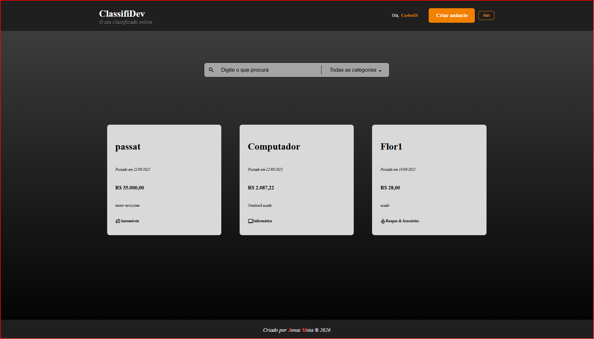
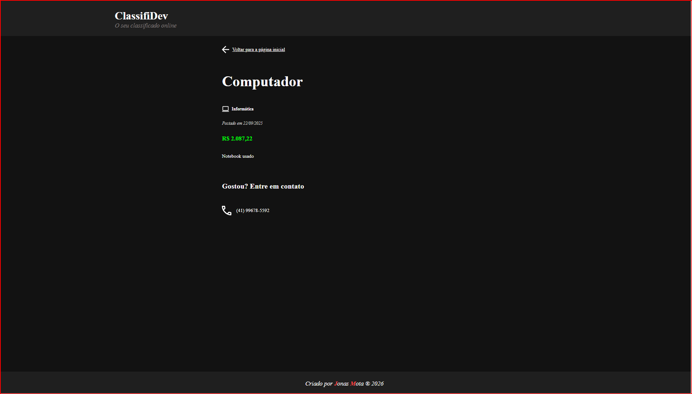
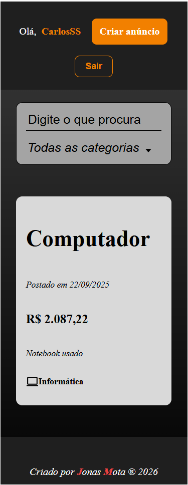
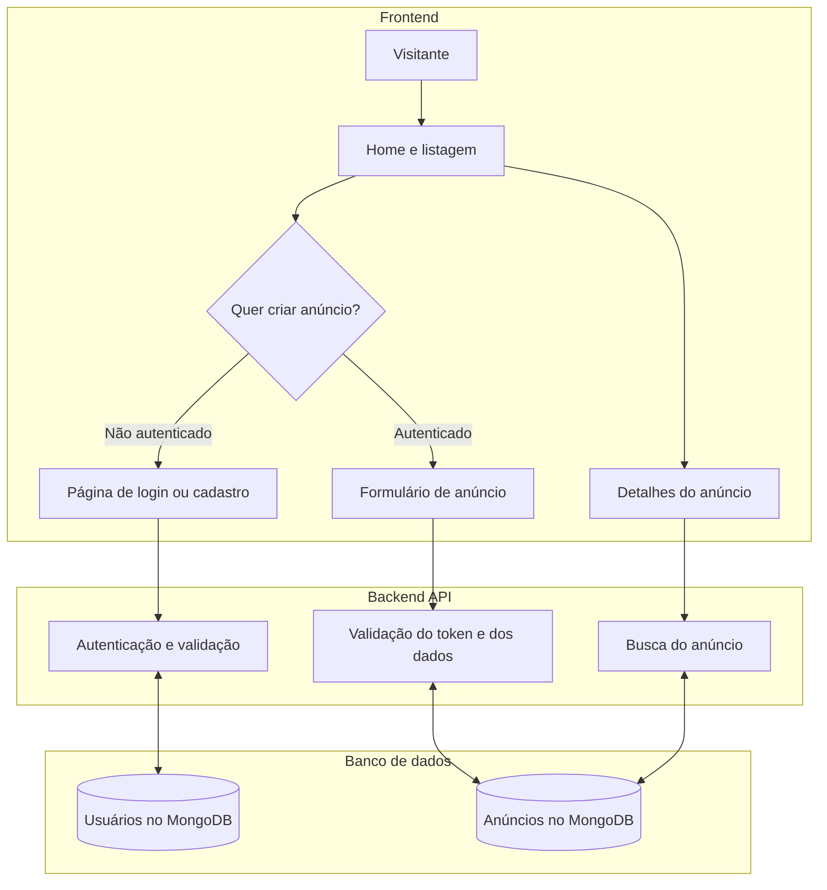
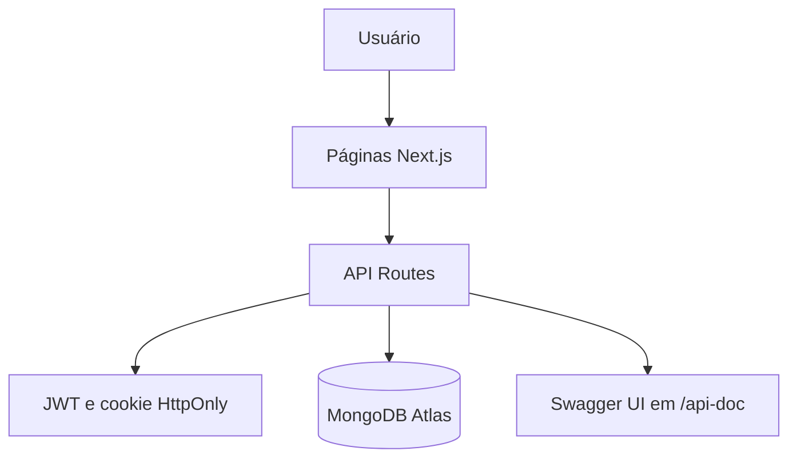

<div align="center">

# ClassifiDev

Uma plataforma de anúncios classificados construída com Next.js, TypeScript e MongoDB.


</div>

### 🔗 Demonstração
👉 **[Acesse o projeto online na Vercel](https://classifidev.vercel.app/)**

## Sobre o projeto

O ClassifiDev permite cadastrar usuários, autenticar por email ou nome de usuário, publicar anúncios e gerenciar os próprios anúncios. A aplicação usa o Pages Router do Next.js e uma API serverless implementada em `src/pages/api`.

## Screenshots

<div align="center">
	
	
	
</div>

## Tecnologias

- [Next.js 14](https://nextjs.org/) com Pages Router
- [React 18](https://react.dev/) e [TypeScript](https://www.typescriptlang.org/)
- [Styled Components](https://styled-components.com/)
- [MongoDB Atlas](https://www.mongodb.com/atlas) e [Mongoose](https://mongoosejs.com/)
- JWT em cookie `HttpOnly` para autenticação
- [React Hook Form](https://react-hook-form.com/) e [Joi](https://joi.dev/) para formulários e validação
- [Swagger UI](https://swagger.io/tools/swagger-ui/) e `next-swagger-doc` para documentação da API
- [Jest](https://jestjs.io/), Testing Library e [Cypress](https://www.cypress.io/) para testes

## Funcionalidades

- Cadastro e login por email ou nome de usuário
- Senhas armazenadas com hash Bcrypt
- Listagem e filtragem de anúncios
- Criação de anúncios para usuários autenticados
- Edição e exclusão de anúncios pelo proprietário
- Interface responsiva para desktop e dispositivos móveis
- Documentação interativa da API em `/api-doc`

## Regras de negócio

- Email e nome de usuário são únicos.
- O token JWT é armazenado em cookie `HttpOnly`.
- O backend verifica o proprietário antes de editar ou excluir um anúncio.
- O frontend exibe os controles de edição e exclusão somente para o proprietário.

## Fluxo da aplicação



## Modelos de dados

### Usuário

| Campo | Tipo | Regras |
| --- | --- | --- |
| `firstName` | String | Obrigatório, máximo de 50 caracteres |
| `lastName` | String | Obrigatório, máximo de 50 caracteres |
| `user` | String | Obrigatório, único, máximo de 30 caracteres |
| `email` | String | Obrigatório, único, máximo de 100 caracteres e formato validado |
| `password` | String | Obrigatório, armazenado com hash Bcrypt |

### Anúncio

| Campo | Tipo | Regras |
| --- | --- | --- |
| `name` | String | Nome do produto, obrigatório |
| `price` | Number | Preço, obrigatório |
| `description` | String | Descrição, obrigatória |
| `category` | String | Categoria, obrigatória |
| `whatsapp` | Number | Contato, obrigatório |
| `date` | Date | Data de criação, preenchida automaticamente |
| `userId` | ObjectId | Referência ao usuário proprietário |

## API

As rotas abaixo são documentadas e podem ser testadas visualmente em [http://localhost:3000/api-doc](http://localhost:3000/api-doc) enquanto o servidor estiver rodando.

| Método | Rota | Acesso | Descrição |
| --- | --- | --- | --- |
| `POST` | `/api/auth/register` | Público | Cria um usuário |
| `POST` | `/api/auth/login` | Público | Autentica e cria o cookie de sessão |
| `POST` | `/api/auth/logout` | Público | Remove o cookie de sessão |
| `GET` | `/api/ads` | Público | Lista anúncios e informações da sessão |
| `POST` | `/api/ads` | Autenticado | Cria um anúncio |
| `GET` | `/api/ads/:id` | Autenticado atualmente | Busca um anúncio pelo ID |
| `PUT` | `/api/ads/:id` | Proprietário | Atualiza um anúncio |
| `DELETE` | `/api/ads/:id` | Proprietário | Remove um anúncio |

> Observação: o handler atual de `/api/ads/[id]` valida o cookie antes de tratar todos os métodos. Por isso, o `GET` por ID exige autenticação atualmente, embora a regra funcional da aplicação preveja a visualização pública de detalhes. Para cumprir essa regra completamente, a autenticação deve ser movida para dentro dos casos `PUT` e `DELETE`.

## Arquitetura



## Estrutura principal

```text
src/
├── components/      # Componentes React reutilizáveis
├── data/context/    # Contexto dos anúncios
├── lib/             # Conexão com banco e configuração Swagger
├── logic/           # Interfaces, schemas e utilitários
├── models/          # Modelos Mongoose
├── pages/           # Páginas e API Routes do Next.js
│   └── api/         # Endpoints de autenticação e anúncios
└── styles/          # Tema e estilos globais
```

## Como executar

### Pré-requisitos

- Node.js 18 ou superior
- npm
- MongoDB local ou uma conexão MongoDB Atlas

### Instalação

Clone o repositório real do projeto. O usuário da URL é o proprietário do repositório, não o nome de quem está fazendo o clone:

```bash
git clone https://github.com/JonsMota/classifidev.git
cd classifidev
npm install
```

Se você estiver usando uma cópia ou um fork, substitua a URL pela URL desse repositório.

### Variáveis de ambiente

Crie `.env.local` na raiz:

```env
MONGODB_URI=mongodb+srv://<usuario>:<senha>@<cluster>/classifidev
JWT_SECRET=gere-uma-chave-secreta
```

Não publique `.env.local` nem credenciais reais no repositório.

### Servidor de desenvolvimento

```bash
npm run dev
```

Acesse:

- Aplicação: [http://localhost:3000](http://localhost:3000)
- Documentação Swagger: [http://localhost:3000/api-doc](http://localhost:3000/api-doc)

## Testes

Testes unitários e de integração:

```bash
npm test
```

Testes E2E com Cypress em modo headless:

```bash
npm run test:e2e
```

O servidor deve estar rodando em outro terminal antes da execução dos testes E2E.

